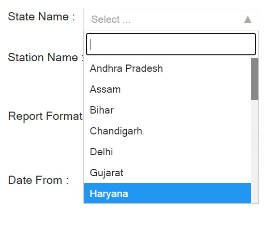

# pollucheck: Open Source Air Quality App!

PolluCheck helps exploring the open source Indian air quality data.

⚡ Fun fact: Its a tidy code!

The link for this app is this - <https://aruapps.shinyapps.io/OpenSourceAirQualityApp/>.

-   PolluCheck (currently in the development phase) is specific to India, and allows users to handle open-source air-quality datasets available from OpenAQ (<https://openaq.org/#/countries/IN?_k=5ecycz>), CPCB (<https://app.cpcbccr.com/ccr/#/caaqm-dashboard-all/caaqm-landing>), and AirNow (<https://www.airnow.gov/international/us-embassies-and-consulates/#India>).
-   Users can visualize data, analyse data, perform basic statistical operations, and generate a variety of publication-ready plots.
-   We have also included the popular openair package in this application.

# Have a look at the app!

### We are in this together!

A walk through to use this app for everyone -

#### How to download data from the CPCB website?

-   Example - Where do you live in India?

-   Find the nearest [CPCB station](https://app.cpcbccr.com/ccr/#/caaqm-dashboard-all/caaqm-landing) to download data from a regulatory air quality monitor.

-   Visit [CPCB website](https://app.cpcbccr.com/ccr/#/caaqm-dashboard-all/caaqm-landing) to access the Central/State Pollution Control Board Data.

-   Select the Indian state from the "State Name" dropdown.

-   Now select the city for which the data needs to be downloaded using the "City Name" dropdown menu.

-   Now from the "Station Name" drop-down select the desired station.

-   Select the Parameters. Note- Multiple parameters can be selected at a time.

-   Report Format- To use the PolluCheck app, Please keep the format as "tabular".

-   Criteria- This drop-down will help you to select between different time averaging of data. Note- Pollucheck app only supports 15 min, 30 min, and 60 min average data.

-   Select the Start Date and End date of the data and click on "Submit".

-   Download that data (15, 30, 60 min resolution would be good).

#### How to download data from the OpenAQ website?

-   Click on [OpenAQ](https://openaq.org/#/countries/IN?_k=5ecycz) in the app to download the OpenAQ dataset.

    

-   Now, click on the "*Download*" option on your browser.

    

-   In data download, you can download the data by "Locations" or by "*Datasets*".

    

-   Now select the desired, "*Country*", "*City/Region*" and "*Location*" using the dropdown.

    

-   To proceed further select the "*Start Date***"** and the "*End Date***"** for the data.

    

-   Now select which type of sensor is available at that location. Is it a "*Low-cost Sensor*" or "*Reference Grade*" monitor?

    

-   Finally, select the parameters from the list of "*Core"* and "*Additional Parameters"* which you wish to download from that particular location and click on "*Download Selection*". The file will be saved in your local disk in .csv format.

    

#### How to download data from the AirNow website?

-   Click on [AirNow-US Embassies](https://www.airnow.gov/international/us-embassies-and-consulates/) to visit official website to download the data.

    

-   Select the desired city and the parameters.

    

-   Now Go to the **"***Historical***"** sub-menu on the Homepage and download the desired file.

    

### Have a look at the app usage

-   Select the source from where the data was downloaded.
-   Now select the time resolution at which the data was downloaded.

-   Select the check box according to your need.

    -   Remove Negative values- Negative values do not represent concentration,they represent missing values, so it is always advised to remove them.This option helps you to remove all the negative values from your entire dataset.

    -   Remove duplicate consecutive values- Sometimes when the instrument breaks down, it tends to show exactly same consecutive values, it is advised to remove these as well. This feature removes consecutive repetitive values in your dataset.

    -   Specify a multiple (X) to remove outliers based on Mean and SD- If you want to clean your dataset based on outliers, not usually necessary, use only if you want to remove outiliers based on Mean and Standard Deviation values.

    -   Specify % of data completeness for computing daily mean values- If you are looking for entire/complete dataset to be present for analysis and not less, you can use this to select the desired level of completeness in a day using the scroll bar.

    -   Remove PM2.5 and PM10 above- Usually, values above 9999 are incorrect, also because the instruments usually measure only to 999 values in PM instruments. This can be removed using this filter option.

    

-   Output aggregation- The uploaded data can be converted into daily or hourly mean values.

-   "Download as csv" or click on "Show Data" to see the data in the app.

-   Look at the time series of pollutant concentrations in the **Plots** tab (time series are plots with x axis representing time). Do you see patterns? Are there times of the month or times of the day where concentrations are particularly higher or lower? Are there particular months in a year that are more polluted than others?
-   Think about sources in the particular location: traffic, industries, garbage burning, etc.
-   What more do you want to learn? Talk to the Humans of ILK.
-   What more do you want to learn about the data? We are happy to incorporate more features based one what users need. Write to us at [contact\@ilklabs.com](mailto:contact@ilklabs.com).
-   If you have feature request - open an issue [here](https://github.com/adithirgis/OpenSourceAirQualityApp).

### The application has various tabs - look at each of them and their usage.

##### File tab displays the data after cleaning process.

##### Summary tab displays the summary statistics for daily, monthly or for the entire dataset.

##### Summary Plots tab generates time series, box plot, and diurnal plot of the selected parameter.

-   Data availability plot of all the pollutants after the cleaning process can be generated.

    

-   The parameter to plot and the data aggregation options are available.

-   Options to edit the Title and axis labels are available.

-   Time-series plot

    

    

-   Month and year box plot

    

-   Monthly box plot

    

-   Vertical bar plot

    

-   Diurnal pot using hourly values - has two types using all data or distributed month wise. There is an option to plot point and bars as Median and IQR respectively or Mean and Standard Deviation. The data used for plotting can be downloaded as csv file.

    

    

##### Statistical Plots tab tests for normality, pattern and generates density plot, qq plot of the selected parameter.

-   Using a selected parameter and aggregation methos, normality test using the Anderson Darling test (for N \> 500) or Shapiro-Wilk test can be conducted.

-   Density plot

    

    

-   Q-Q plot

    

    

-   Trend Analysis is also available for daily values. For trend analysis using Mann-Kendall test we use [mk.test](https://www.rdocumentation.org/packages/trend/versions/1.1.4/topics/mk.test). For imputing values in the discontinuous data set we use [forecast package](https://cran.r-project.org/web/packages/forecast/forecast.pdf). For continuous wavelet transform we use [biwavelet package](https://cran.r-project.org/web/packages/biwavelet/biwavelet.pdf). In periodicity analysis, the contours covered by black lines represent the significant periodicity at 95% significant 519 level.\\

-   Autocorrelogram plot can also be generated using the

    

    

    

##### Linear Regression tab does linear and multi linear regression for selected parameter(s).

-   There is an option of plotting linear regression plots between various parameters available.

    

    

-   Also multi linear regression can be performed.

    

    

##### Compare tab allows users to upload another file for comparision with the loaded data.

-   The Compare tab allows user to upload data from another site for comparison and generate time series and a scatter plot between parameters selected from different sites.

-   There are options to generate time series, scatter plot / linear regression and diurnal plots for both the sites.

    

    

    

##### `openair` tab allows users use the package's widely used functions for the selected parameter.

-   Calendar plot

    

    

-   Time variation plot

    

## Community guidelines

1.  Contribute to the software

-   Please open an issue in the issue tracker of the project that describes the changes you would like to make to the software and open a pull request with the changes.

1.  Report issues or problems with the software / Seek Support

-   Please open an issue in the [issue tracker of the project.](https://github.com/adithirgis/OpenSourceAirQualityApp/issues)
