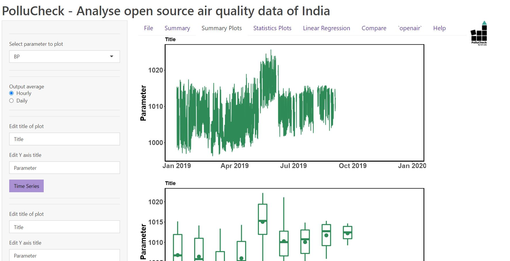
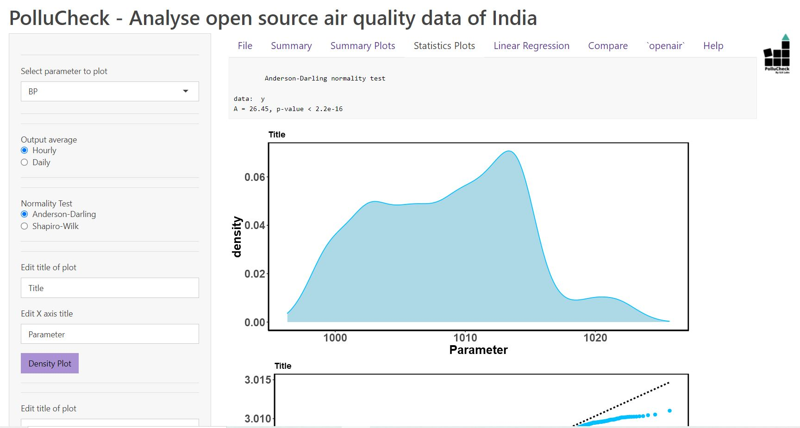
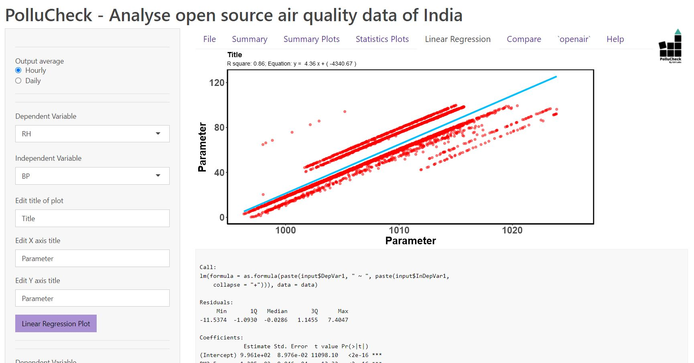
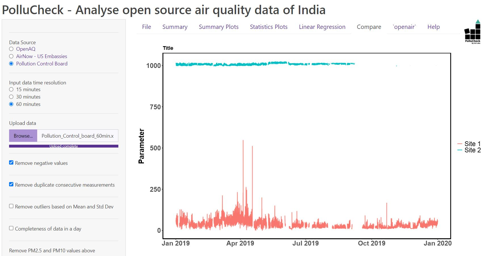
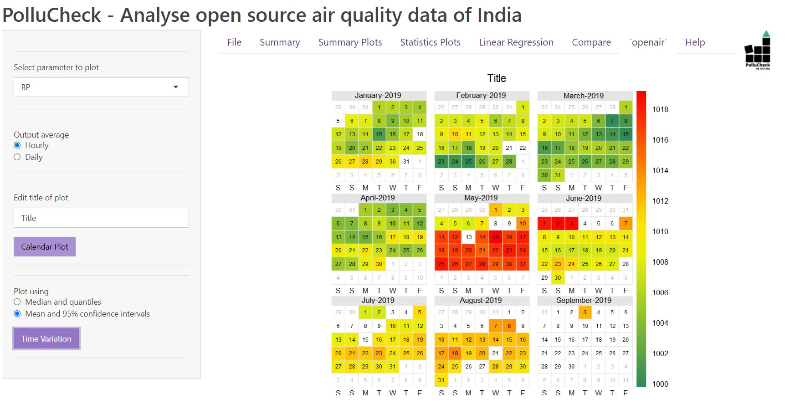

# Have a look at the app!

### We are in this together!

A walk through to use this app for everyone -

How to Download Data from the CPCB website?

-   Example - Where do you live in India?

-   Find the nearest [CPCB
    station](https://app.cpcbccr.com/ccr/#/caaqm-dashboard-all/caaqm-landing)
    to download data from a regulatory air quality monitor.

-   Visit [CPCB
    website](https://app.cpcbccr.com/ccr/#/caaqm-dashboard-all/caaqm-landing)
    to access the Central/State Pollution Control Board Data.

-   Select the Indian state from the “State Name” dropdown.

-   Now select the city for which the data needs to be downloaded using
    the “City Name” dropdown menu.

-   Now from the “Station Name” drop-down select the desired station.

-   Select the Parameters. Note- Multiple parameters can be selected at
    a time.

-   Report Format- To use the PolluCheck app, Please keep the format as
    “tabular”.

-   Criteria- This drop-down will help you to select between different
    time averaging of data. Note- Pollucheck app only supports 15 min,
    30 min, and 60 min average data.

-   Now select the Start Date and End date of the data and click on
    “Submit”.
-   Download that data (15, 30, 60 min resolution would be good).
-   Select the source from where the data was downloaded.
-   Now select the time resolution at which the data was downloaded.

-   Select the check box according to your need.

    -   Remove Negative values- Negative values do not represent
        concentration,they represent missing values, so it ie always
        advised to remove them.This option helps you to remove all the
        negative values from your entire dataset.

    -   Remove consecutive repeated measurements- Sometimes when the
        instrument breaks down, it tends to show exactly same
        consecutive values, it is advised to remove these as well. This
        feature removes consecutive repetitive values in your dataset.

    -   Remove outliers based on Mean and Std Dev- If you want to clean
        your dataset based on outliers, not usually necessary, use only
        if you want to remove outiliers based on Mean and Standard
        Deviation values.

    

    -   Completeness of data in a day- If you are looking for
        entire/complete dataset to be present for analysis and not less,
        you can use this to select the desired level of completeness in
        a day using the scroll bar.

    

-   Remove PM2.5 and PM10 values above- Usually, values above 999 are
    incorrect, also because the instruments usually measure only to 999
    values in PM instruments. This can be removed using this filter
    option.

-   Output average- The uploaded data can be converted into daily or
    hourly mean values.

-   “Download the csv” or click on “Show Data” to see the data in the
    app.

-   Look at the time series of pollutant concentrations in the **Plots**
    tab (time series are plots with x axis representing time). Do you
    see patterns? Are there times of the month or times of the day where
    concentrations are particularly higher or lower? Are there
    particular months in a year that are more polluted than others?
-   Think about sources in the particular location: traffic, industries,
    garbage burning, etc.
-   What more do you want to learn? Talk to the Humans of ILK.
-   What more do you want to learn about the data? We are happy to
    incorporate more features based one what users need. Write to us at
    <contact@ilklabs.com>.
-   If you have feature request - open an issue
    [here](https://github.com/adithirgis/OpenSourceAirQualityApp).

### The application has various tabs - look at each of them and their usage.

##### File tab displays the data after cleaning process.

##### Summary tab displays the summary statistics for daily, monthly or for the entire dataset.

##### Summary Plots tab generates time series, box plot, and diurnal plot of the selected parameter.

##### Statistics Plots tab tests for normality, pattern and generates density plot, qq plot of the selected parameter.

##### Linear Regression tab does univariate and multivariate linear regression for selected parameter(s).

##### Compare tab allows users to upload another file for comparision with the loaded data.

##### `openair` tab allows users use the package’s widely used functions - calendar plot and diurnal pattern for the selected parameter.

### Explore yourself!

##### The major pollutants annual standards are plotted below.
