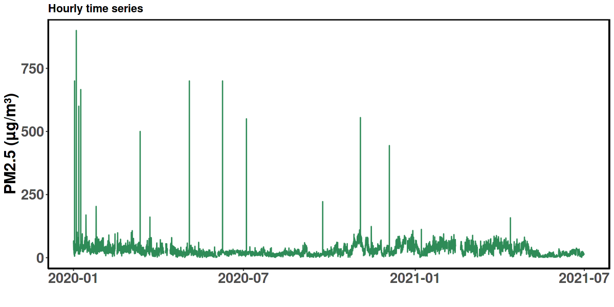
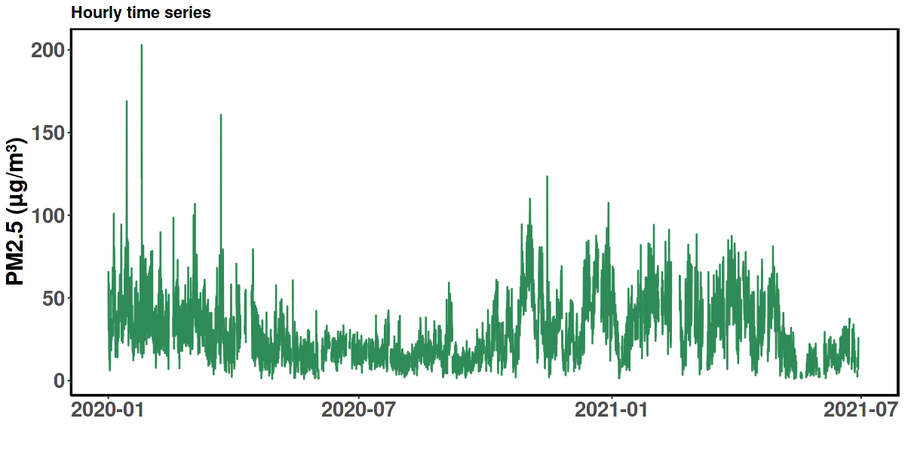
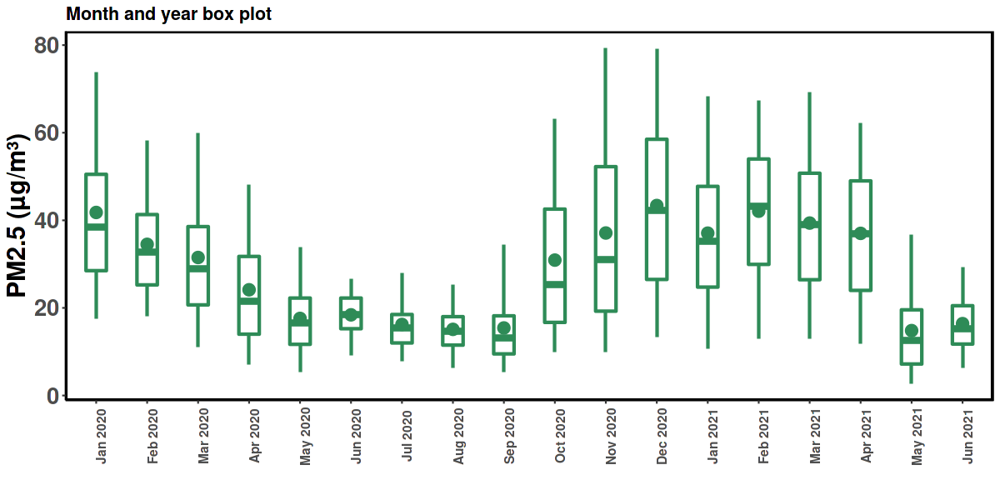
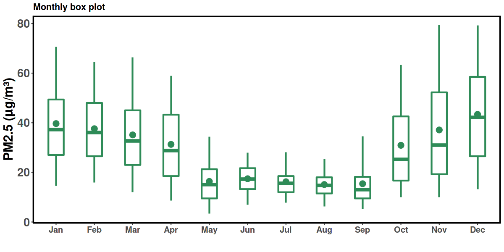
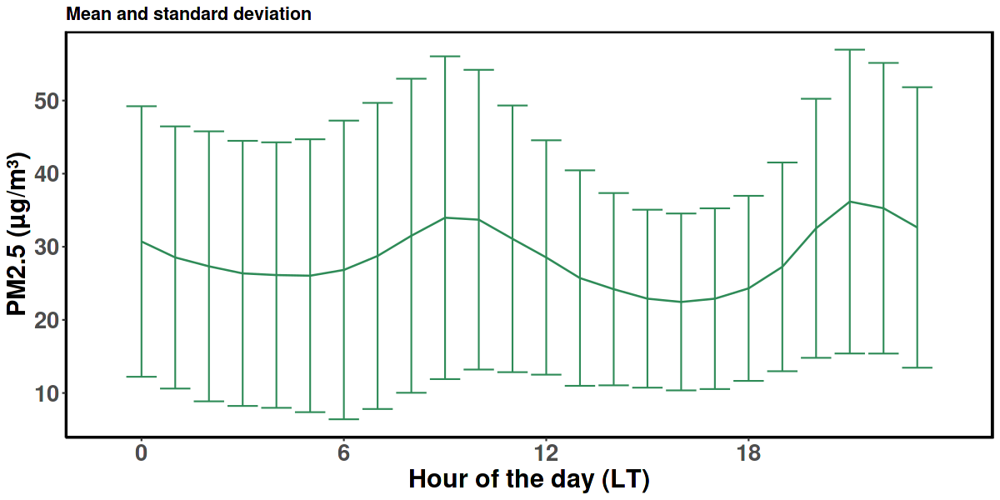
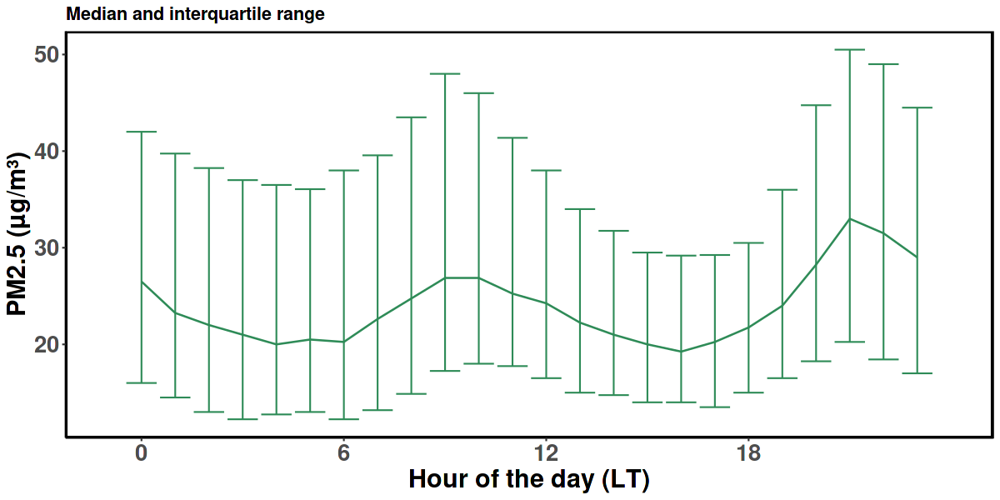
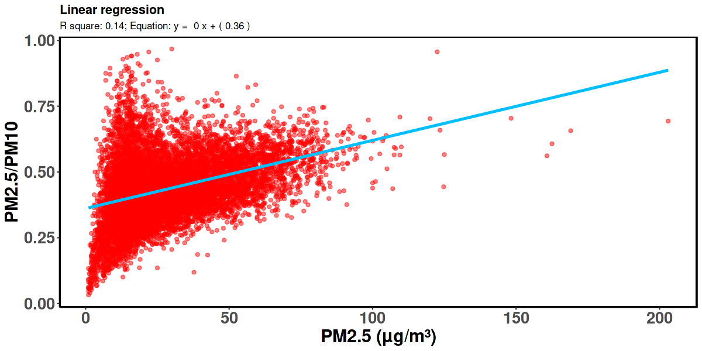
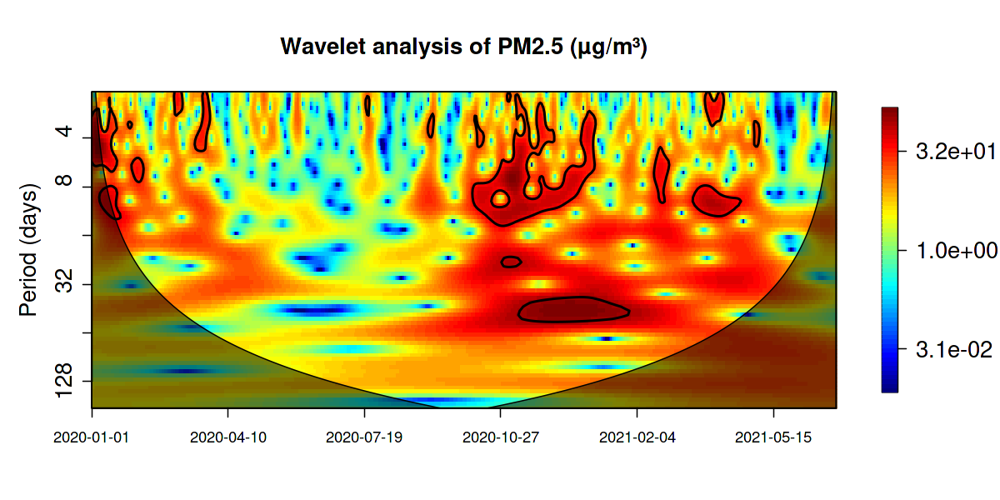

# Summary

Air pollution impacts human health, quality of living, climate and the economy [@Hystad:2020]. To assess its impact and facilitate mitigation actions quantification of air pollution is vital. Measurements are the most accurate way of quantifying air pollution. Many countries conduct regulatory measurements of various air pollutants (e.g, fine and respirable particulate matter, nitrogen dioxide, sulfur dioxide and surface ozone) and make the data available publicly.

Air pollution data sets typically span several seasons or years and real-time data are recorded typically every hour or at a higher frequency. With the ever increasing amount of data and number of data providers, there is a clear need for tools to handle, analyse, and visualise large data sets. `Shiny` is a package in R that helps build interactive applications [@Shiny:2021]. The current Shiny app `pollucheck` aims at a simple workflow to generate a suite of statistical plots and summary statistics. Users do not need any programming background to analyse time-series data and generate a variety of plots.

`pollucheck` can handle real-time pollution and co-located meteorological data (if available) from the three most popular open-source air pollution databases: [OpenAQ](openaq.org), [AirNow](airnow.gov) and [Indian Central Pollution Control Board (CPCB) dashboard](app.cpcbccr.com). While CPCB data are specific to Indian regulatory monitoring stations, OpenAQ hosts the global open source pollution databases and AirNow hosts the global PM~2.5~ (mass concentration of particulate matter with an aerodynamic diameter less than or equal to 2.5 microns) data, collected under the United States Embassy and Consulates' air quality monitoring programmes.

Pollution data from these sources are typically in different file formats and templates that require customised codes or programmes for analysis. Also, a rigorous quality check of the data is preferred before visualisation (plotting) and reporting. `pollucheck` offers a single-stop solution for

(i) handling the pollution data from the open-source databases,
(ii) applying a suite of quality-check options,
(iii) generating a variety of summary statistics at various averaging intervals,
(iv) performing time-series analysis,
(v) generating a bunch of temporal and statistical plots, and 
(vi) comparing data from two input files.

To our knowledge, currently, there is no application that can generate utilisable summary statistics and plots using the data from the pollution databases. However, there are a few Shiny apps that deal with data cleaning and visualisation of pollution data collected from single/multiple air quality instruments [@Salmon:2017; @Upadhya:2020].

# App Display

The output of `pollucheck` is displayed in seven tabs. Different packages used for building `pollucheck` include `tidyverse`, `openair`, `shiny`, `bslib`, `forecast`, `biwavelet`, `readxl`, `DT`, `data.table`, `nortest`, and `zoo`.

i) The `File` tab is used to upload the input file and to specify the source and time resolution of the input data. The default time zone is set to *Asia/Kolkata*. For OpenAQ and AirNow data sets, appropriate time zones need to be selected based on the input file. For the CPCB data set, the time zone option is default and inactive. A set of quality check options (a) removal of negative values, (b) removal of consecutive duplicate values, and (c) detection of outliers are provided. Data completeness criteria (minimum percentage of data required) for computing daily mean values can be specified. If the input file contains simultaneous PM~2.5~ and PM~10~ (mass concentration of particulate matter with an aerodynamic diameter less than or equal to 10 microns) data, the app computes the PM~2.5~/PM~10~ ratio, a useful metric in the air pollution field to identify sources of PM and to estimate PM~2.5~ when only PM~10~ is available [@Chan:2008; @Chu:2015; @Spandana:2021]. The selected quality check or completeness criteria will be applied to all the parameters of the input file. Hourly or daily mean values of all the parameters can be displayed and downloaded (as `.csv`) from this tab.

ii) The `Summary` tab provides various statistics (central tendencies, percentiles, minimum, maximum, standard deviation, interquartile range, etc.) for all the parameters in the input file at three different averaging intervals. The averaging intervals can be selected using the drop-down menu. The displayed statistics can be downloaded.

iii) The `Summary Plots` tab generates (a) a data availability plot for all the parameters (based on daily mean values), (b) a time-series plot (c) box and whisker plots (d) a vertical bar plot and (e) diurnal variability plots. Except for the data availability plot, the parameter of interest to a plot needs to be selected from the dropdown menu. Plots can be generated using hourly or daily mean data. The diurnal variability plots can be plotted either by aggregating the whole data in the input file or month wise. Considering the general log-normal nature of the pollution data, an option is provided for the diurnal variability plots to be plotted using mean and standard deviations or median and interquartile ranges. The title and y-axis labels of the plots are editable.

iv) The `Statistical Plots` tab can be used to conduct normality tests (Anderson Darling and Shapiro-Wilk), generate density and quantile-quantile (QQ) plots, generate autocorrelogram, and conduct trends and periodicity analysis on the parameter selected. While autocorrelogram is generated based on monthly mean values, trend (the Mann-Kendall test) and periodicity (wavelet analysis) analyses are conducted on daily mean values of the selected parameter. For trend and periodicity analyses and generating autocorrelogram, the missing daily mean values are imputed using the `forecast` package [@Hyndman:2008].

v) The `Linear Regression` tab offers to perform univariable and multiple linear regression analyses among the parameters of choice. For univariable linear regression, a scatter plot will be generated with least-squares linear fit. For multiple linear regression, multiple independent parameters can be selected. A scatter plot between the dependent variable and fitted data (using regression coefficients) will be generated. Relevant statistical coefficients are provided along with the plots.

vi) The `Compare` tab allows users to upload a second data file to compare data between the selected parameters from the two input files. The selected quality-check criteria conditions applied on the parameters of the first input file will be automatically applied to the parameters in the second input file. Time-series, scatter, and diurnal variability plots of the two parameters of interest will be generated.

vii) Some features of the widely used `openair` package [@Carslaw:2012] are integrated into  `pollucheck` with permission. Calendar and time variation plots of the selected parameter are generated in this tab. Daily data will be used for Calendar plots and hourly data will be used for time variation plots.

An extensive list of frequently asked questions (FAQs) is provided as a separate tab for a better understanding of the `pollucheck` functioning, detailed features of the plots,  and analysis and the various packages used to build 'pollucheck'.

# Limitations

1)  `pollucheck` does not download data automatically from the cloud. Downloaded files need to be provided as input.
2)  Multiple files cannot be uploaded to `pollucheck` at a given time.
3)  The current version of `pollucheck` is limited to accepting real-time data files from only three data sources.
4)  Some analyses (e.g. periodicity analysis) can be performed using daily mean values only.
5)  Caution needs to be exercised when using the averaged wind direction data.
6)  Any manipulation or alteration to the downloaded file before giving it as input to the app can lead to erroneous results.

## Installation

`pollucheck` can be installed from [GitHub](https://github.com/).

Load and run `pollucheck` as follows:

``` {.r}
devtools::install_github("adithirgis/pollucheck")
library(pollucheck)
pollucheck::pollucheck_run()
```

`pollucheck` is furnished with a preloaded data set for a quick user tour of the analysis and, plotting options and the functions available. In the `Compare` tab, the preloaded data set act as the second input file if no second file is uploaded.

# Case Study

For better understanding of the major functionalities of pollucheck, we present a case study based on 18 months of pollution data set. Only plots related to PM~2.5~ data generated through the app are showcased here. Figure 1 depicts the efficiency of the app in detecting the outliers. Top panel of figure 1 shows the hourly time series of the raw PM~2.5~ (few outliers were synthetically added to the data), while the bottom panel depicts the quality checked data. Almost all the sporadically high values were detected by the app as outliers and removed.


{ width=100% }


{ width=100% }
  

Figure 2 depicts the difference between **Month and year box plot** and **Monthly box plot**. These plots are highly useful if the dataset length is more than a year. **Monthly box plot** (bottom panel) partitions all the data points into the calendar month bins irrespective of the year. While **Month and year box plot** (top panel) accounts for the entire timeline i.e. including the year.

{ width=100% }


{ width=100% }


Diurnal variation in PM~2.5~ based on mean (and standard deviation) and median (and interquartile range) are shown in the top and bottom panels of figure 3, respectively. The choice between mean and median is useful when the distribution of the data deviates from normal. In the top panel, the line depicts the mean and the vertical bars depict standard deviation.  In the bottom panel, the line depicts the median and the vertical bars depict the Interquartile range.


{ width=100% }


{ width=100% }

In figure 4, a linear regression is shown between PM~2.5~ and the PM~2.5~/PM~10~ ratio.  The app computes the ratio using the individual PM~2.5~ and PM~10~ data sets. The blue line depicts the least square linear fit. The R-square and the equation of the linear fit are also provided on the panel.

{ width=100% }


The periodicity in PM~2.5~ is shown as a wavelet periodogram (figure 5). Wavelet analysis is useful in analysing non-stationary time series data. Only daily averaged data will be used for this analysis and missing data is imputed to perform the wavelet analysis. 

{ width=100% }


# Acknowledgements

We wish to thank Prof. Julian D Marshall (University of Washington, Seattle), Prof. Joshua Apte (University of California, Berkeley), Dr. Jai Asundi (Center for Study of Science, Technology and Policy, Bengaluru), Dr Saumya Singh (University of California, Berkeley) and R community for their help and support.

# References
